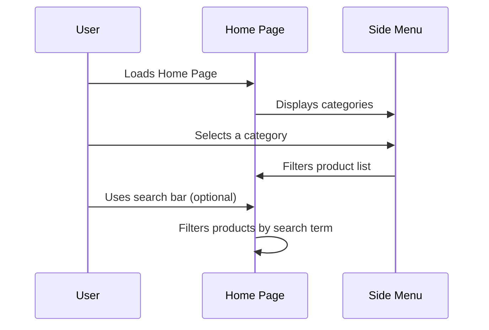
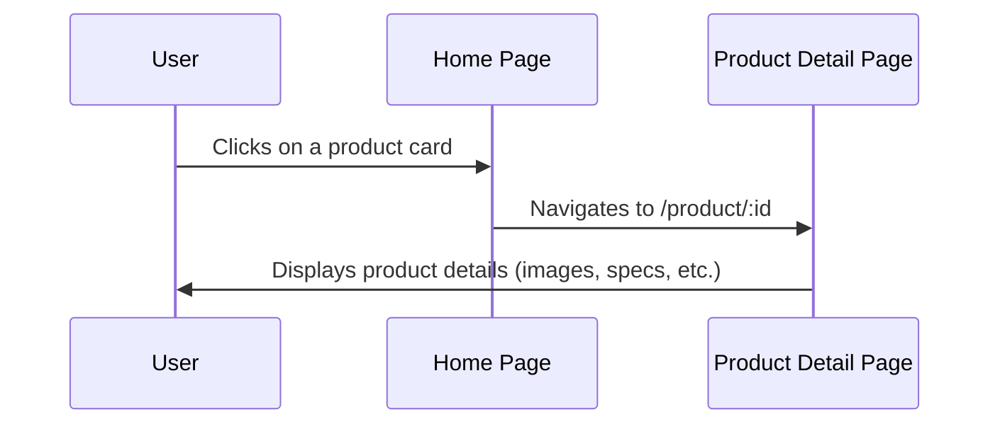
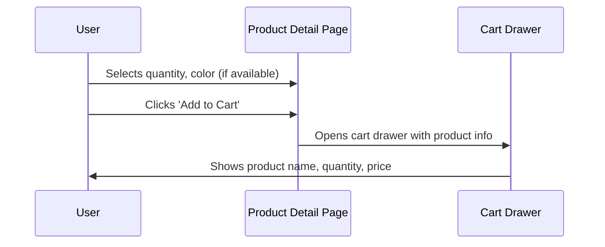
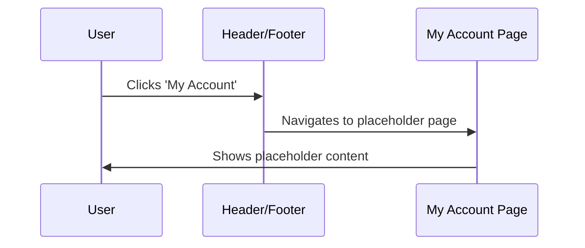

# Application Flow: Nuxt E-Commerce Frontend PoC

## 1. User Journey Map

```mermaid
flowchart TD
    A[Entry: Home Page] --> B{Select Category?}
    B -- Yes --> C[Filter Products by Category]
    B -- No --> D[View All Products]
    C --> E[Search Products]
    D --> E
    E --> F{Click Product?}
    F -- Yes --> G[View Product Detail]
    F -- No --> H[Exit or Continue Browsing]
    G --> I{Add to Cart?}
    I -- Yes --> J[Cart Drawer]
    I -- No --> H
    J --> K{Proceed to Checkout?}
    K -- No --> H
    K -- Yes --> L[Exit: Checkout (Out of Scope)]
    H --> M[Exit: Leave Site]
```

- **Entry Points:**
  - Home page (direct, search, or referral)
- **Critical Paths:**
  - Browse/filter/search products → View product detail → Add to cart
- **Exit Points:**
  - Leave site
  - Proceed to checkout (checkout flow is out of MVP scope)

---

## 2. Core Interaction Flows (MVP)

### Flow 1: Browse and Filter Products


### Flow 2: View Product Detail


### Flow 3: Add to Cart and View Cart Drawer


### Flow 4: My Account (Placeholder)


---

## 3. Error Handling Flows

- **Missing Product Data:**
  - If a product file is missing or corrupt, show a generic error message or skip rendering that product.
- **No Products in Category/Search:**
  - Display a friendly message: "No products found."
- **Cart Add Failure:**
  - If adding to cart fails (e.g., invalid quantity), show an inline error message.
- **Navigation to Nonexistent Product:**
  - Show a 404 or 'Product Not Found' message.

---

## 4. Success Metrics

- User can filter and search products by category and text.
- User can view product details for any listed product.
- User can add a product to the cart and see it in the cart drawer.
- User can access the My Account placeholder page.
- Error states are handled gracefully with user-friendly messages.

---

## Example Flow: Add to Cart (Happy Path & Error)

### Happy Path
1. User browses products and selects a category.
2. User searches for a product and clicks a product card.
3. On the Product Detail page, user selects quantity and clicks 'Add to Cart'.
4. Cart drawer opens, showing the product with correct quantity and price.

### Error Scenario
1. User tries to add a product with invalid quantity (e.g., zero or negative).
2. System displays an inline error: "Please select a valid quantity."
3. User corrects the quantity and successfully adds the product to the cart.

---

This document outlines the MVP user flows, error handling, and success criteria for the Nuxt E-Commerce Frontend PoC.
